# Maal Wallet — Admin Dashboard UI

A walkthrough of the Maal Wallet admin dashboard, restyled to match the mobile app
(lime accent `#C5FD41` on deep navy `#090329`, Inter typography). Live at
**https://admin.146.148.39.5.sslip.io**.

> Screenshots rendered at 2× for clarity. Data shown is representative.

## Sign in
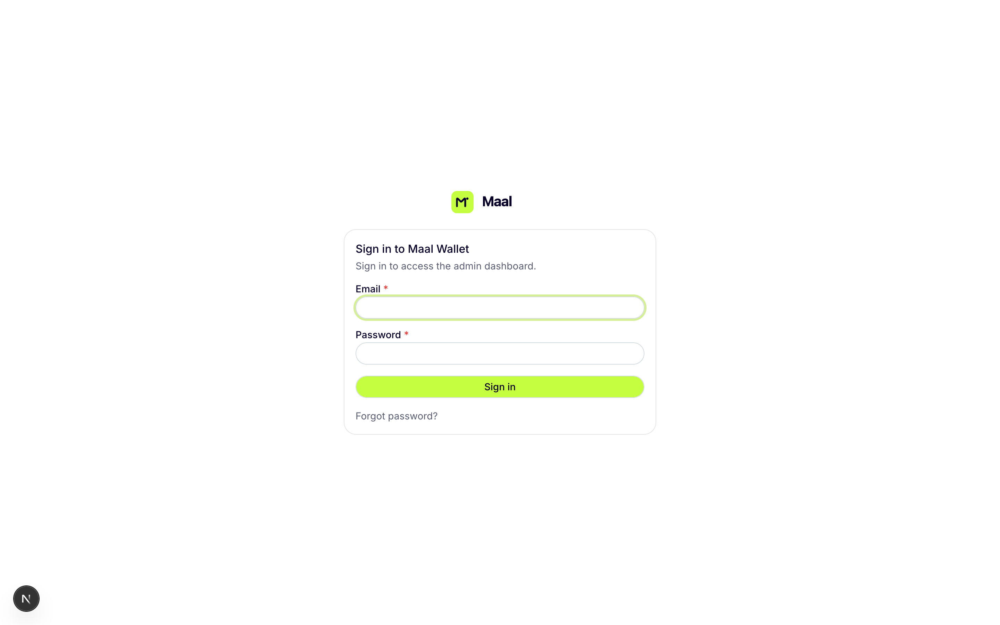

## Dashboard
Operational overview — active users, transaction volume, financing exposure, and live work queues.
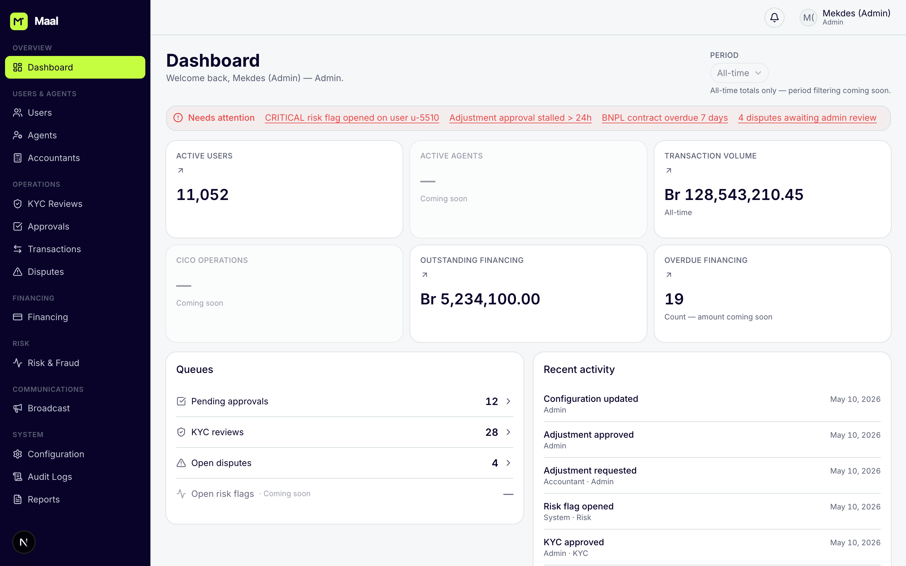

## Users
Search and manage end-user accounts: KYC tier, status, balance.
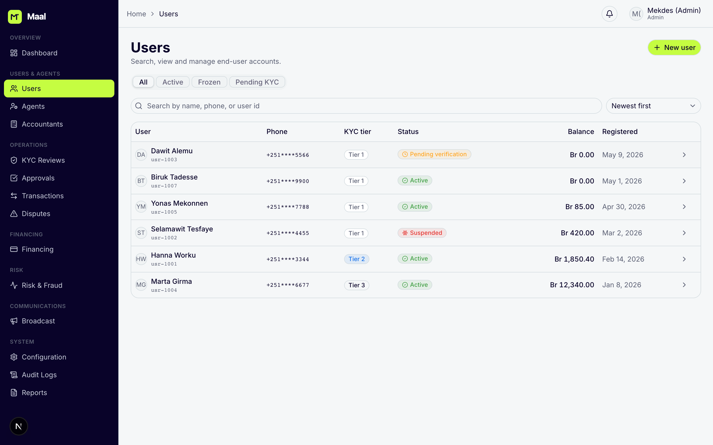

## Agents
The CICO agent network — float, commission, daily activity, and status.
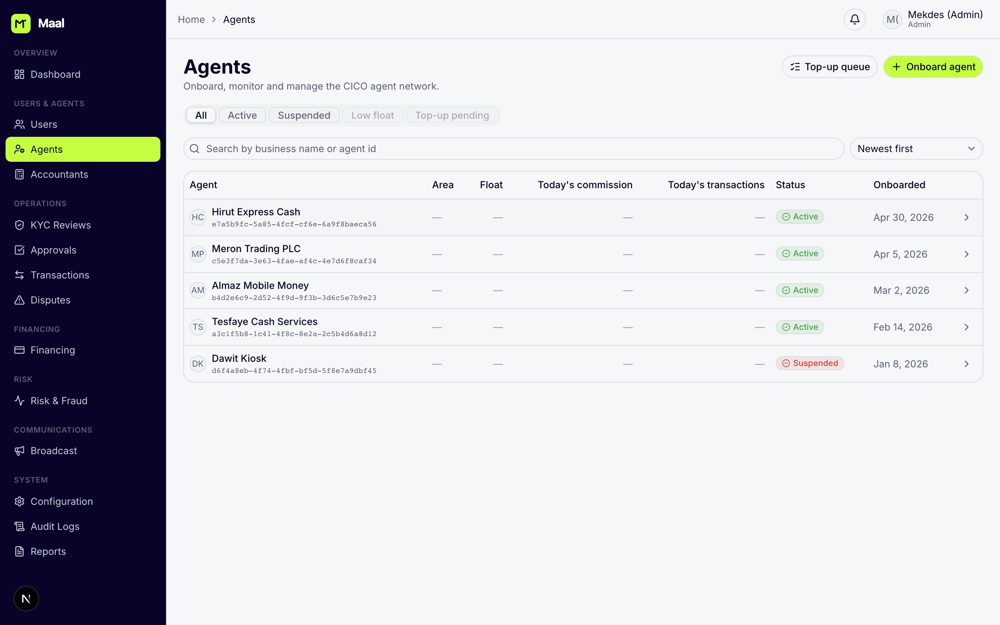

## Accountants
Internal accountant accounts (admin-created, no self-service).
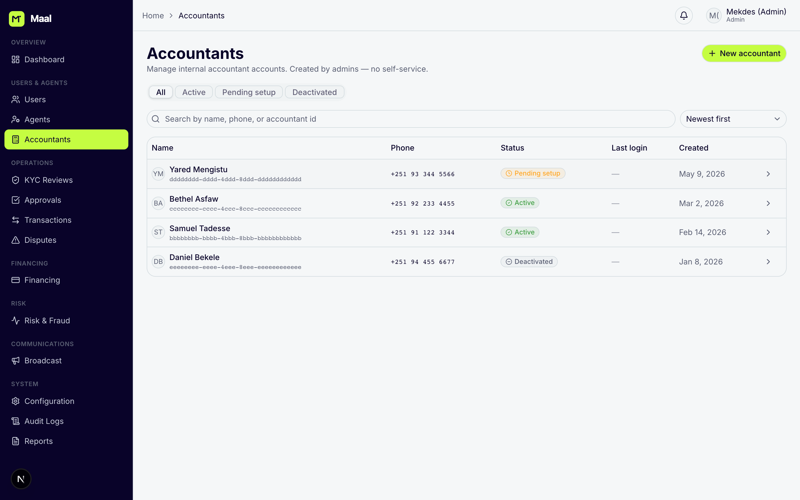

## KYC Reviews
Approve, request resubmission, or reject KYC submissions with SLA tracking.
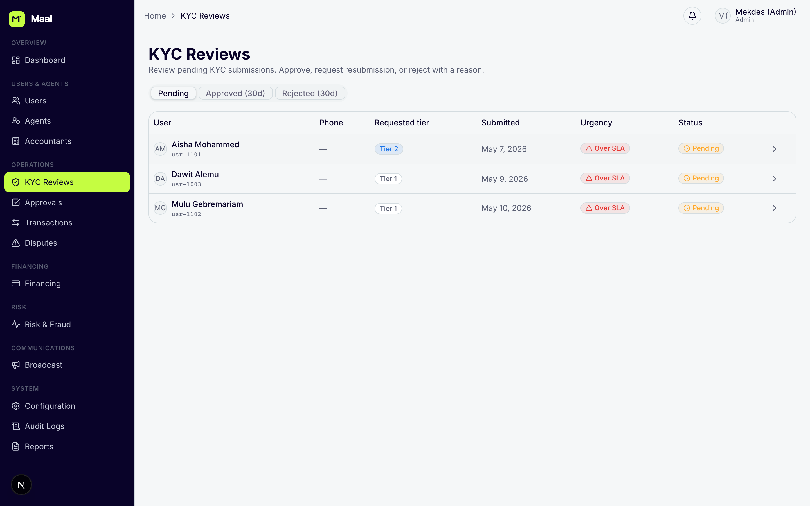

## Approvals
Review and decide accountant-submitted ledger adjustment requests.
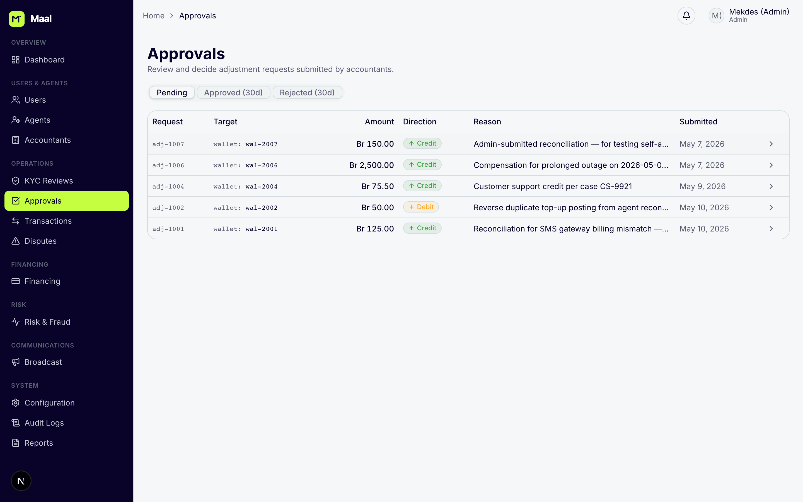

## Transactions
System-wide search, inspection, and admin-only reversal — with full direction/status detail.
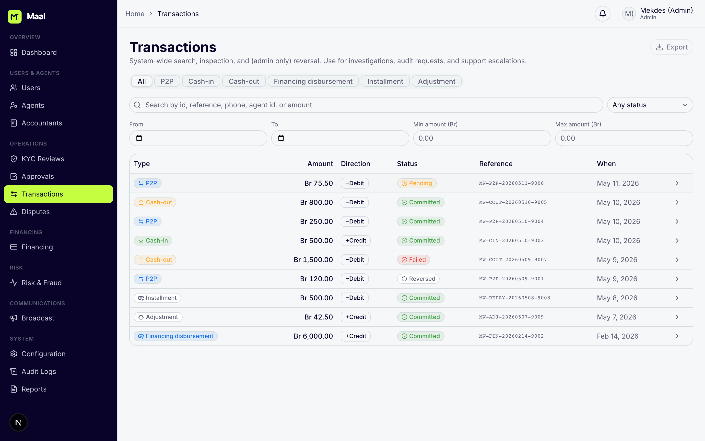

## Disputes
Resolve CICO disputes raised by users against agent transactions.
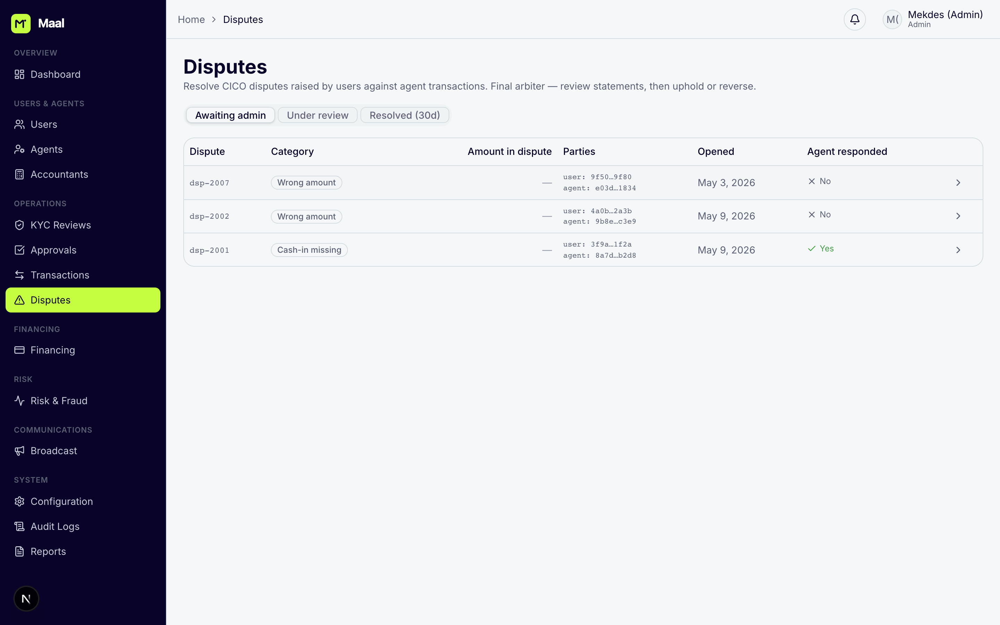

## Financing (BNPL)
Manage interest-free BNPL products and contracts; outstanding, overdue, and written-off balances.
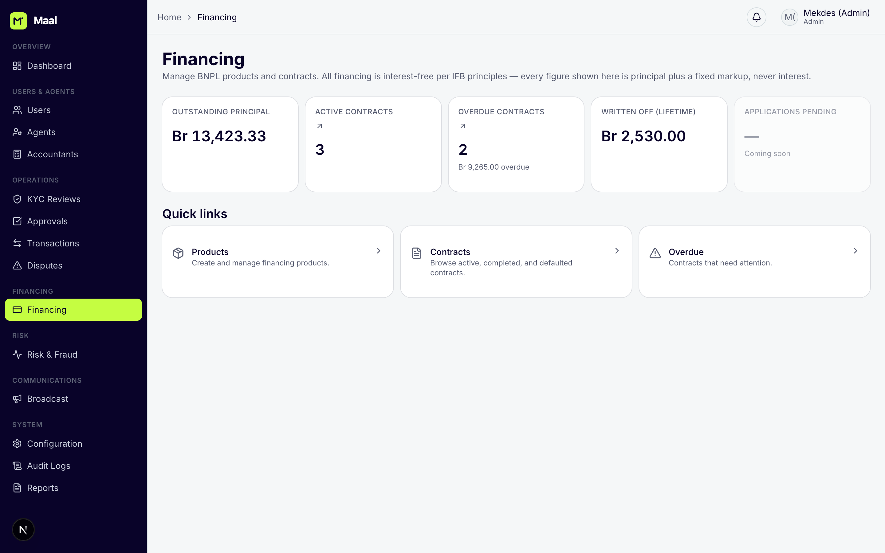

## Risk & Fraud
Review AI risk and fraud signals — all decisions are human-reviewable and audit-logged.
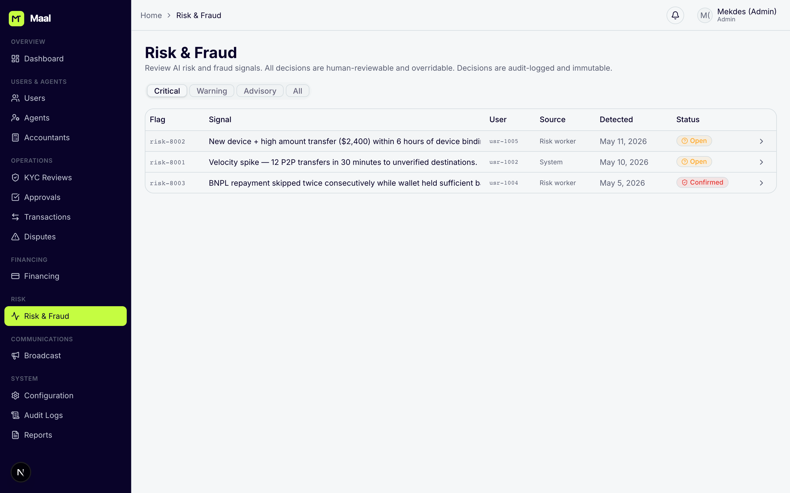

## Broadcast
Send an in-app or SMS announcement to selected audiences.
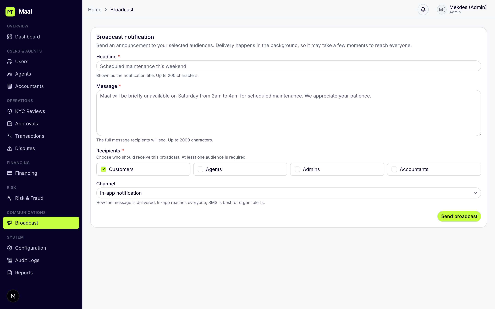

## System Configuration
Inspect and change limits, commission, risk, feature, and auth settings.
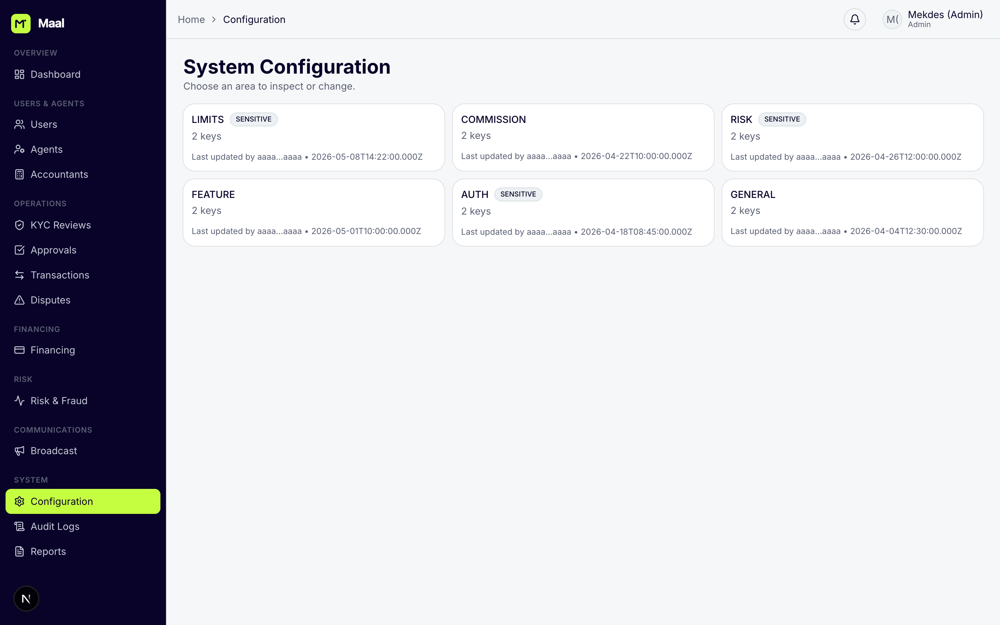

## Audit Logs
Immutable, append-only record of every sensitive action.
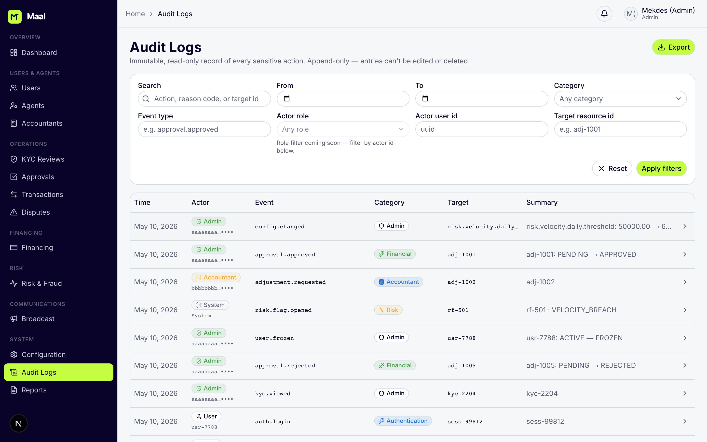

## Reports
Generate operational and compliance reports.
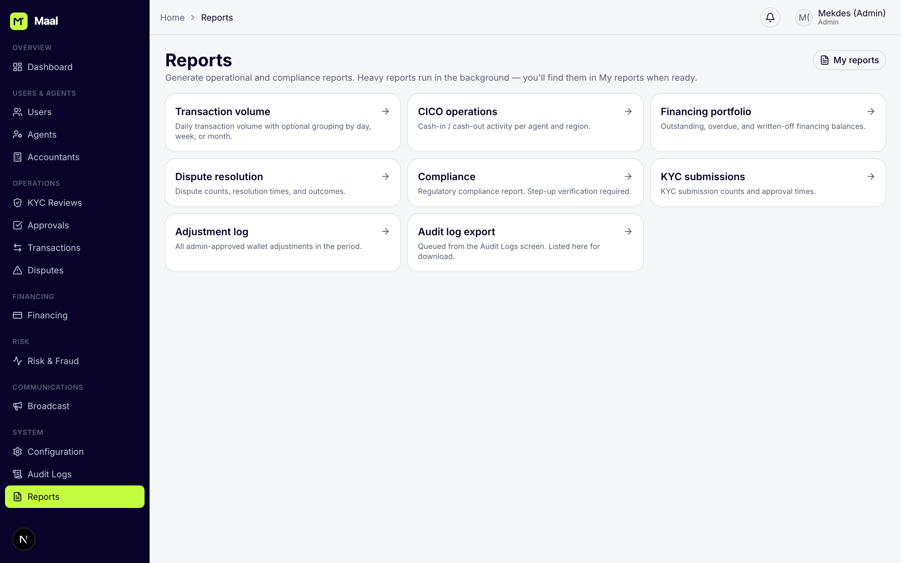
